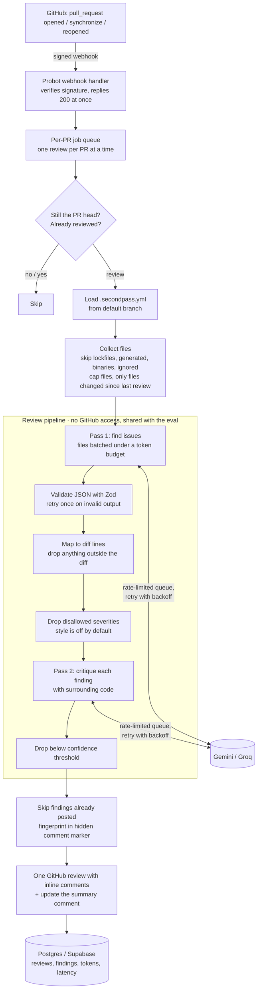

# SecondPass

[](https://github.com/saeedbeingsaeed/SecondPass/actions/workflows/ci.yml)

An AI code reviewer that runs as a GitHub App. When a pull request is opened or updated,
SecondPass reads the diff and the full changed files, asks an LLM to review them, has a
second LLM pass double-check every finding, and posts the survivors as inline comments on
the exact lines, plus one short summary comment.

It runs entirely on free tiers: Gemini or Groq for the model, Supabase for Postgres,
Render for hosting, GitHub Actions for CI.

```text
🐛 Bug · confidence 0.95

The loop runs while i <= xs.length, so the last iteration reads xs[xs.length], which is
undefined. Adding undefined to a number gives NaN, so sum() always returns NaN.

▸ Suggested fix
```

## Contents

- [How it works](#how-it-works)
- [Evaluation results](#evaluation-results)
- [Local setup](#local-setup)
- [Configuration](#configuration)
- [Deploying to Render](#deploying-to-render)
- [Logging to Postgres](#logging-to-postgres)
- [Running the evaluation](#running-the-evaluation)
- [Design decisions](#design-decisions)
- [Project structure](#project-structure)
- [Limitations](#limitations)

## How it works



1. **Webhook.** Probot verifies the `X-Hub-Signature-256` HMAC, then the handler queues the
   job and replies immediately. A review can take a minute because of rate limits; GitHub
   gives up on a webhook after 10 seconds.
2. **Skip work that is not needed.** Each PR has its own queue. A job first checks that its
   commit is still the PR head (so five quick pushes cost one review) and that the commit
   has not already been reviewed (so redeliveries and reopens are free).
3. **Pick files.** Lockfiles, generated code, binaries, deleted files and paths ignored in
   `.secondpass.yml` are skipped. On an update, only files changed since the last reviewed
   commit are sent. File and token caps apply, and anything skipped is listed in the summary.
4. **Pass 1** sends each file with line numbers and diff markers and asks for JSON findings
   (`file`, `line`, `severity`, `confidence`, `explanation`, `suggestedFix`).
5. **Validation and mapping.** Output is validated with Zod (one retry with the error fed
   back), and each finding must land on a line that is part of the diff, or it is dropped.
6. **Pass 2** shows a skeptical reviewer each claim with the code around it and keeps only
   what it can justify. Its confidence replaces pass 1's, then the threshold is applied.
7. **Post.** Findings already posted on this PR are skipped; the rest go out as one review
   pinned to the reviewed commit, and the summary comment is updated in place.
8. **Log** the review, its findings, token counts and latency to Postgres.

## Evaluation results

`npm run eval` runs the same pipeline on PRs with a known planted bug, without posting, and
measures whether the bug was caught. The three cases are the open PRs in
[secondpass-eval-fixtures](https://github.com/saeedbeingsaeed/secondpass-eval-fixtures/pulls):
a pagination off-by-one, a SQL injection, and an `async` callback inside `forEach`.

Run on 2026-10-08:

| Provider | Model                   | Pass 2 | Recall     | Comments / PR | Tokens / PR | LLM calls / PR | Latency / PR |
| -------- | ----------------------- | ------ | ---------- | ------------- | ----------- | -------------- | ------------ |
| gemini   | `gemini-3.1-flash-lite` | on     | 100% (3/3) | 1.0           | 1,771       | 2.0            | 22.1s        |
| gemini   | `gemini-3.1-flash-lite` | off    | 100% (3/3) | 1.0           | 1,068       | 1.0            | 13.0s        |

What this shows, and what it does not:

- Every planted bug was caught, with no extra comments (one bug per PR, one comment per PR).
- On these small, single-bug PRs, pass 2 removed nothing, so it cost about 66% more tokens
  for no gain. Its job is to cut false positives on noisier PRs, which these cases do not
  contain. The next cases to add are PRs with **no** bug and larger mixed PRs, to measure
  false positives directly.
- Latency is dominated by the deliberate 13-second spacing between requests that keeps the
  bot inside Gemini's free-tier rate limit, not by the model.
- Three cases is far too few to compare models. Treat this as a working harness with a
  first data point, not a benchmark.

## Local setup

You need Node.js 22.12+ (Node 20 reached end-of-life in April 2026, and Probot's dependencies now require 22), a GitHub account and a Google account. Nothing here needs a card.

1. **Install**

   ```sh
   gh repo clone saeedbeingsaeed/SecondPass   # or git clone
   cd SecondPass
   npm install
   cp .env.example .env
   ```

2. **Gemini API key.** Create one at <https://aistudio.google.com/apikey> and set
   `GEMINI_API_KEY` in `.env`. Leave billing off so the key stays on the free tier.
   Free quotas are per model and per day, which is why the default is a "lite" model.

3. **Register the GitHub App.** Run `npm run dev`, open <http://localhost:3000> and click
   **Register a GitHub App**. Probot reads [`app.yml`](app.yml) for permissions and events,
   creates a [smee.io](https://smee.io) channel to forward webhooks to your machine, and
   writes `APP_ID`, `PRIVATE_KEY`, `WEBHOOK_SECRET` and `WEBHOOK_PROXY_URL` into `.env`.

4. **Install the app** on a test repository (the setup page links to it; choose
   **Only select repositories**).

5. **Restart** with `npm run dev`. The log shows `Using gemini (...)` and the smee URL it
   forwards from. Open a pull request in the test repo and the review appears within about
   a minute.

If nothing happens, check the app's settings page → **Advanced** → **Recent Deliveries**
to see whether GitHub sent the webhook and what the response was.

### Scripts

| Command             | What it does                               |
| ------------------- | ------------------------------------------ |
| `npm run dev`       | Build and start the app locally            |
| `npm start`         | Start the built app (used in Docker)       |
| `npm test`          | Run the Vitest suite                       |
| `npm run lint`      | ESLint and Prettier checks                 |
| `npm run typecheck` | TypeScript type check                      |
| `npm run eval`      | Run the evaluation harness (posts nothing) |
| `npm run format`    | Format everything with Prettier            |

## Configuration

### Environment variables

All settings live in `.env` (locally) or the host's environment (in production). Every one
is documented in [`.env.example`](.env.example). The main ones:

| Variable                         | Default  | Purpose                                        |
| -------------------------------- | -------- | ---------------------------------------------- |
| `LLM_PROVIDER`                   | `gemini` | `gemini` or `groq`                             |
| `GEMINI_API_KEY`, `GEMINI_MODEL` |          | Gemini key and model                           |
| `GROQ_API_KEY`, `GROQ_MODEL`     |          | Groq key and model                             |
| `GEMINI_MIN_INTERVAL_MS`         | `13000`  | Gap between requests (stays under ~5/minute)   |
| `GROQ_MAX_TOKENS_PER_CALL`       | `5000`   | Groq's free tier has a small tokens/minute cap |
| `REVIEW_SECOND_PASS`             | `true`   | Turn the critique pass on or off               |
| `MAX_FILES_PER_REVIEW`           | `25`     | Large-PR file cap                              |
| `MAX_INPUT_TOKENS_PER_REVIEW`    | `60000`  | Large-PR token cap                             |
| `DATABASE_URL`                   | (off)    | Postgres connection string for logging         |

Settings are validated with Zod at startup, so a missing key or a typo stops the app with a
clear message instead of failing on every review.

### Per-repo `.secondpass.yml`

Add `.secondpass.yml` to the root of a repo's **default branch**. It is not read from PR
branches, so a PR cannot switch off its own review. Every key is optional:

```yaml
# Glob patterns to skip, on top of lockfiles, generated files and binaries.
ignore:
  - "docs/**"
  - "*.snap"
# Findings below this confidence (0-1) are not posted. Default 0.6.
confidenceThreshold: 0.7
# Which kinds of findings to post. Default: bug, security, performance (style is off).
severities: [bug, security, performance]
```

If the file is invalid, SecondPass falls back to the defaults and says so in the summary.

## Deploying to Render

The repo includes a [`Dockerfile`](Dockerfile) and a Render Blueprint
([`render.yaml`](render.yaml)). Render's free web service needs no card.

1. Push this repository to GitHub (already done if you cloned it from there).
2. On <https://render.com>, sign up with GitHub, then **New → Blueprint** and pick this repo.
   Render reads `render.yaml`: a free Docker web service with a health check on `/ping`.
3. Render asks for the secret values. Copy them from your local `.env`:
   - `APP_ID`, `WEBHOOK_SECRET`, `GEMINI_API_KEY` (and `GROQ_API_KEY`, `DATABASE_URL` if used).
   - `PRIVATE_KEY`: paste the whole key, including the `-----BEGIN` and `-----END` lines.
     Render accepts multi-line values.
   - Do **not** set `WEBHOOK_PROXY_URL` in production; smee is only for local development.
4. Wait for the deploy to go live, then note the URL, e.g. `https://secondpass-xxxx.onrender.com`.
   Opening that URL in a browser shows "SecondPass is running", and `/ping` returns `PONG`.
   If the deploy shows **Failed**, the **Logs** tab says why (usually a missing variable).
5. In GitHub → Settings → Developer settings → GitHub Apps → your app → **General**, set
   **Webhook URL** to `https://secondpass-xxxx.onrender.com/api/github/webhooks` and save.
6. Stop your local `npm run dev` (otherwise both would review the same PRs) and open a PR.

### Cold starts on the free plan

A free Render service sleeps after 15 minutes without traffic and takes roughly 30-60
seconds to wake. GitHub waits only 10 seconds for a webhook response, so the first webhook
after a quiet period can be marked as failed in **Recent Deliveries**. SecondPass is built
so this is safe to handle:

- The handler replies before doing any work, so once awake it always answers in milliseconds.
- Reviews are idempotent: the reviewed commit is recorded on GitHub (in the summary comment),
  so **redelivering** a webhook from **Recent Deliveries** never double-posts.
- To avoid sleeping altogether, ping `https://<your-service>.onrender.com/ping` every
  10-14 minutes with a free scheduler such as [cron-job.org](https://cron-job.org) (no card).
  One always-on service fits inside Render's 750 free instance-hours per month. Ping
  `/ping`, not `/robots.txt`, which Render answers itself while the service sleeps.

## Logging to Postgres

Every review is logged with its status, provider, model, token counts, model and total
latency, filter counts and its findings. Code and prompts are never stored.

1. Create a free project at <https://supabase.com>.
2. Open **SQL Editor**, paste [`src/db/schema.sql`](src/db/schema.sql) and run it (safe to re-run).
3. Click **Connect**, copy the **Session pooler** URI, fill in your password, and set it as
   `DATABASE_URL`.

Useful queries:

```sql
-- Tokens and latency per day
select date_trunc('day', created_at) as day, count(*) as reviews,
       sum(input_tokens + output_tokens) as tokens, round(avg(total_latency_ms)) as avg_ms
from reviews group by 1 order by 1 desc;

-- How much each filter removes
select sum(pass1_findings) as found, sum(dropped_second_pass) as dropped_by_pass2,
       sum(dropped_low_conf) as dropped_low_confidence, sum(findings_posted) as posted
from reviews;
```

The schema enables row level security with no policies, which blocks Supabase's
auto-generated public REST API from reading the tables. The app connects as the database
owner and is unaffected. If `DATABASE_URL` is empty, logging is off and nothing else changes.

## Running the evaluation

```sh
npm run eval                                          # default provider, pass 2 on and off
npm run eval -- --provider gemini,groq                # compare providers
npm run eval -- --second-pass off                     # one setting only
npm run eval -- --cases my-cases.json --tolerance 2   # own cases, looser line matching
```

Cases live in [`eval/cases.json`](eval/cases.json). Each one names a PR and where the known
bug is (line numbers in the PR's version of the file):

```json
{
  "repo": "owner/name",
  "pr": 12,
  "description": "What the bug is, for humans",
  "bug": { "file": "src/cart.js", "startLine": 26, "endLine": 30 }
}
```

A bug counts as caught if any final finding is in that file within the range (widened by
`--tolerance`). Each PR is fetched once and reused for every configuration, so all
configurations review identical input. Results print as a Markdown table and are saved in
full to `eval/results/`. Without `GITHUB_TOKEN`, GitHub allows 60 API requests an hour.

## Design decisions

**Webhook first, work later.** The handler only queues the job and returns. Reviews take
tens of seconds because of rate limits, and GitHub times out after 10 seconds.

**State lives on GitHub, not in memory.** The last fully reviewed commit is stored in a
hidden marker in the summary comment, and each inline comment carries a fingerprint. This
survives restarts and Render's free tier sleeping, and needs no database. Postgres is only
for logging, so it can be down without affecting reviews.

**Fingerprints ignore line numbers and wording.** A fingerprint is a hash of the file, the
severity and the code on the line (whitespace-normalised). Code moving down after an edit
keeps the same fingerprint; the model rewording its explanation does too.

**Validate the model's output, don't trust it.** The top-level JSON must match the Zod
schema or the request is retried once with the error message. Individual malformed findings
are dropped and counted, so one bad item does not discard the good ones. Every finding must
point at a line GitHub will accept a comment on; the diff parser works this out from the
hunk header counts and has the most tests in the suite.

**Comments use `line` + `side`, not `position`.** The diff `position` field is GitHub's
legacy API. The current form addresses the line in the new file directly.

**Pass 2 judges, it doesn't search.** It sees each claim with about 17 lines of context and
a skeptical brief, and anything without an explicit "keep" is dropped. Up to 15 findings are
judged in one request. Severity filtering happens before pass 2 (no point paying to critique
style findings), and the confidence threshold after it.

**Degrade instead of failing.** If pass 2 is unavailable, pass 1's findings are posted and
the summary says they were not double-checked. If a batch fails twice, its files are listed
as not reviewed and the commit is not marked as reviewed, so the next push retries them.

**One rate-limited queue per provider.** Free-tier limits apply to the whole account, not
to a review. Every request, including retries, waits its turn and starts at least the
configured interval after the previous one. Rate-limit and server errors are retried with
exponential backoff that honours the provider's `retry-after`, and a request is not retried
at all when the provider asks for a wait longer than a minute (an exhausted daily quota).

**Plain `fetch`, no SDKs.** Each provider is about 80 lines behind a three-field interface
(`name`, `model`, `complete`). Adding Groq required no changes to the pipeline.

**Config from the default branch.** Reading `.secondpass.yml` from the PR branch would let
a PR add `ignore: ["**"]` and switch off its own review.

**Secrets stay out of logs.** API keys are sent in headers, never URLs. Logs contain IDs,
counts and error messages only, never code, prompts or model output.

## Project structure

```text
src/
  index.ts             Starts Probot (signature checks, smee, /ping)
  app.ts               Webhook handler and per-PR job queue
  review-job.ts        One review end to end: skip checks, collect, review, post, log
  config.ts            Environment settings, validated with Zod
  llm/                 Provider interface, Gemini, Groq, retry/backoff, rate-limit queue
  github/              PR files and contents, config file, comments, inline review
  review/              The pipeline: diff parsing, prompts, schema, filters, formatting
  db/                  schema.sql and the Postgres logger
eval/                  Evaluation harness, metrics and test cases
test/                  Vitest tests (diff mapping, parsing, filtering, retries, ...)
app.yml                GitHub App manifest (permissions and events)
Dockerfile             Production image
render.yaml            Render Blueprint
```

## Limitations

- Two different issues on the same line with the same severity share a fingerprint, so only
  one is posted.
- An incremental review only sends files changed in the new push. A bug that depends on an
  unchanged file in the same PR can be missed on that push.
- The per-PR queue is in memory. If the process restarts mid-review, that review is lost
  until the next push or a redelivered webhook.
- The model sees changed files, not the whole repository, so it cannot check callers in
  other files.
- `.secondpass.yml` changes made in a PR only take effect once merged.
